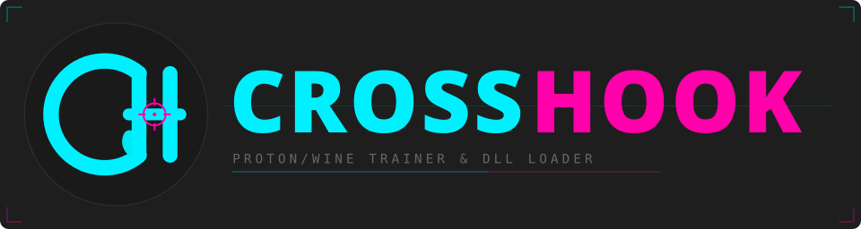

# **🚂 CrossHook**

[](https://github.com/yandy-r/crosshook-loader/releases)
[](https://github.com/yandy-r/crosshook-loader/releases)
[](https://github.com/yandy-r/crosshook-loader)
[](LICENSE)

**Proton/WINE Trainer & DLL Loader**  
A loader for SteamOS/Linux/macOS that handles launches of games with trainers/mods (FLiNG, WeMod, etc.), patches, and up to 5 extra executables or DLLs, bypassing the issues of launching mods/patches in WINE/Proton enviroments 🔥.

<p align="center">
  
</p>

<p align="center">
  
</p>
---

## **Download & Links**

[](https://github.com/yandy-r/crosshook-loader/releases)

Going forward, download CrossHook from the [GitHub Releases page](https://github.com/yandy-r/crosshook-loader/releases). The standard release workflow (`.github/workflows/release.yml`) publishes these zip assets:

- `crosshook-win-x64.zip` for the normal 64-bit case
- `crosshook-win-x86.zip` for 32-bit compatibility cases

Install by extracting the entire zip into any directory you want to keep CrossHook in, then launch `crosshook.exe` from the extracted folder. Do not run it from inside the zip, and do not move only `crosshook.exe` by itself.

[](https://github.com/yandy-r/crosshook-loader/releases)  
[](https://github.com/yandy-r/crosshook-loader)

---

## **Build & Publish**

The migration now uses the SDK-style `net9.0-windows` project. Build and publish with the .NET 9 SDK:

```bash
dotnet build src/CrossHookEngine.sln -c Release
./scripts/publish-dist.sh
```

The release policy is dual artifacts, `win-x64` and `win-x86`, so the migration keeps the current AnyCPU and bitness-sensitive injection behavior intact.

The packaging script produces the release artifacts under `dist/`:

- `dist/crosshook-win-x64/`
- `dist/crosshook-win-x86/`
- `dist/crosshook-win-x64.zip`
- `dist/crosshook-win-x86.zip`

Ship the zipped `dist/crosshook-win-*.zip` artifacts, or copy the matching `dist/crosshook-win-*` directory as a unit. `.github/workflows/release.yml` uploads these zips to the GitHub Releases page with auto-generated notes when a `v*` tag is pushed or the workflow is run manually.

Important: this is still a directory-based self-contained publish, not a single-file executable. `crosshook.exe` must stay beside `crosshook.dll`, `crosshook.deps.json`, `crosshook.runtimeconfig.json`, and the bundled runtime files from the extracted release folder. If you copy only `crosshook.exe` into another directory, WINE/.NET will fail with an error like `The application to execute does not exist: ...\\crosshook.dll`.

The raw `src/CrossHookEngine.App/bin/Release/net9.0-windows/<rid>/publish/` directories remain implementation details of `dotnet publish`. The repo-root `crosshook.exe` is also a legacy checked-in file and is not a release artifact.

`Profiles/`, `Settings/`, and `settings.ini` are user/runtime state and are intentionally excluded from `dist/` release artifacts. The app creates or tolerates those paths at runtime, so upgrades should not ship them.

Use `win-x64` by default for modern 64-bit game/trainer flows. Keep `win-x86` for 32-bit compatibility cases.

For the full local workflow, including the optional repo-local SDK path and exact step-by-step commands, see [`docs/internal-docs/local-build-publish.md`](docs/internal-docs/local-build-publish.md).

### **Why is this Needed for Proton/WINE?**

Running game trainers, patches, and DLL injectors in **Proton** or **WINE** can be problematic due to compatibility issues, anti-cheat false positives, and differences in Windows API implementations. Many game trainers and mods rely on system calls that work natively on Windows but fail under Proton/WINE.

**CrossHook** solves these issues by:

✅ **Ensuring Proper Trainer Execution** – Many trainers rely on system-level hooks and memory modifications that fail in WINE. CrossHook makes sure they load properly.

✅ **DLL Injection Support** – Some patches, mods, or debuggers need to inject DLLs into the game process, which can fail in WINE without proper handling.

✅ **Multiple Executable Launching** – Games requiring launchers, mod frameworks, or patches alongside the main executable can be difficult to set up in Proton.

✅ **Proton/WINE UI Compatibility Fixes** – Prevents common graphical/UI bugs that occur when running trainers in a non-native Windows environment.

✅ **Seamless Steam Deck Integration** – Works effortlessly with Steam's Proton compatibility layer, making it easy to add trainers and patches on the go.

Whether you are playing on **Linux**, **macOS (via Whisky)**, or **Steam Deck**, **CrossHook** makes sure that your trainers, DLLs, and patches just...work.

---

## **Features At a Glance**

| **Feature**                  | **Description**                                                                                     |
| ---------------------------- | --------------------------------------------------------------------------------------------------- |
| **Dual Launch**              | Automatically start both game and trainer (or any EXE) together.                                    |
| **Additional EXEs/DLLs**     | Inject up to 5 extra binaries (patches, scripts, additional trainers).                              |
| **Profiles**                 | Save, load, and auto-launch configurations from custom profile files.                               |
| **Auto Launcher**            | Optional startup mode that launches your last-used profile immediately (with a configurable delay). |
| **Recent Files (MRU)**       | Quickly reselect your most recently used game or trainer executables.                               |
| **Proton & WINE Compatible** | Streamlined UI adjustments for smooth operation on Steam Deck, Wine, or Proton.                     |

---

## **Quick Start (Steam Deck)**

1. **Switch to Desktop Mode**
   - Tap the Steam Deck's **Power** button → **Switch to Desktop**.

2. **Download & Extract CrossHook**
   - Open the [GitHub Releases page](https://github.com/yandy-r/crosshook-loader/releases).
   - Download `crosshook-win-x64.zip` unless you specifically need the 32-bit `crosshook-win-x86.zip`.
   - Extract the full zip into a folder you want to keep, such as `~/Applications/CrossHook` or another game tools directory.

3. **Add CrossHook to Steam**
   - Open Steam on your Deck (in Desktop Mode).
   - Go to **Games** → **Add a Non-Steam Game to My Library** → Select the extracted `crosshook.exe`.

4. **Enable Proton**
   - In your Steam Library, **right-click** on CrossHook → **Properties** → **Compatibility**.
   - Check **Force the use…** and pick a Proton version (Proton 9+ recommended).

5. **Configure & Launch**
   - Click **Play** to open CrossHook.
   - Choose your **Game Path**, **Trainer Path**, and any extra DLLs/EXEs.
   - (Optional) **Save a Profile** and enable **Auto Launcher**.
   - Finally, hit **Launch**.

🚀 **Quick Tip for Steam Deck Users!** 🎮

If you're using **WINE/Proton** and can't find your Steam games, create a **symlink** to make them easily accessible:

```sh
ln -s ~/.steam/steam/steamapps/common ~/STEAMGAMES
```

## WeMod/Trainer Not Launching (Fix) (Proton/WINE)

If trainers like **WeMod** aren't working, remove **Wine-Mono** and install .NET instead using **Protontricks** or **Heroic Launcher**.

### Using Protontricks

1. Install Protontricks (if not installed)  
   `flatpak install com.github.Matoking.protontricks`

2. Open Protontricks & Select Your Game  
   `protontricks --gui` or launch it from the menu in Desktop mode.
   - Select your **game/trainer bottle**
   - Choose **Run Wine Control Panel**

3. Uninstall Wine-Mono
   - In **Control Panel**, go to **Add/Remove Programs**
   - Find **Wine Mono Windows Support**
   - Click **Uninstall** and follow the prompts

4. Install .NET Framework (if needed)
   - Set your Bottle's Windows Version to Windows 7 using the Wine Control Panel.
   - Download .NET from **Microsoft's official site** (You'll want .NET 4.7.1 if you're using WeMod)
   - Inside Protontricks, select **Run Wine File Manager** or **Run EXE**
   - Run the .NET installer inside the Wine bottle
   - Set your Bottle's Windows Version back to Windows 10 using the Wine Control Panel.

---

### Using Heroic Launcher

1. Open **Heroic Launcher**
2. Go to **Your Game** → **Config/Settings**
3. Click **Winetricks** → **Open WineTricks GUI**
4. Choose **Select the Default Prefix**
5. Click on **Run Uninstaller**
6. Remove **Wine Mono Windows Support**
7. Press **OK** to return to the WineTricks GUI
8. Select **Run an arbitrary executable (.exe/.msi/msu)** and use this to install .NET from the official installer.

   (You'll want .NET 4.7.1 for WeMod)

Now trainers like **WeMod** should work properly on Steam Deck.

---

## **Quick Start (macOS with Whisky)**

1. **Install Whisky**
   - Get the latest version of **Whisky** for macOS.

2. **Download & Extract CrossHook**
   - Open the [GitHub Releases page](https://github.com/yandy-r/crosshook-loader/releases).
   - Download `crosshook-win-x64.zip`.
   - Extract the full zip into a folder you want to keep, then use that extracted folder as the source for Whisky.

3. **Create a Bottle & Add CrossHook**
   - In Whisky, create a new **bottle**.
   - Use **"Run Executable"** and pick the extracted `crosshook.exe`.

4. **Configure & Run**
   - In the bottle's settings, enable **DXVK** (and other needed compatibility tweaks).
   - Press **Run** to start CrossHook.
   - Inside CrossHook, set **Game Path**, **Trainer Path**, and extras.
   - **Launch** to start your game + trainer simultaneously.

<del>If trainers like <b>WeMod</b> are not working properly in <b>CrossOver/Whisky</b>, removing <b>Wine-Mono</b> and installing the official <b>.NET Framework</b> can help.</del>

<del>## WeMod/Trainer Not Launching (Fix) (macOS)</del>

<del>**Open Whisky**</del>  
<del>- Launch **Whisky** on macOS.</del>

<del>**Go to Bottle Configuration**</del>  
<del>- Open your game/trainer's **bottle** in Whisky and hit Bottle Configuration.</del>

<del>**Open Control Panel**</del>  
<del>- Inside the bottle, open **Control Panel**.</del>

<del>**Uninstall Wine-Mono**</del>  
<del>- In **Control Panel**, go to **Applications** or **Add/Remove Programs**.</del>  
<del>- Set your Bottle's Windows Version to Windows 7 using the Wine Control Panel.</del>  
<del>- Find **Wine Mono Windows Support**.</del>  
<del>- Click **Uninstall** and follow the prompts.</del>

<del>### **Install .NET Framework (Manually)**</del>

<del>Since some trainers require .NET, download and install it manually:</del>

<del>1. **Download the .NET Framework** from [Microsoft's official site](https://dotnet.microsoft.com/en-us/download/dotnet-framework).</del>  
<del>2. Set your Bottle's Windows Version to Windows 7 using the Wine Control Panel.</del>  
<del>3. Inside Whisky, **run the .NET installer** inside the bottle.</del>  
<del>4. Follow the installation steps as you would on Windows.</del>  
<del>5. Set your Bottle's Windows Version back to Windows 10 using the Wine Control Panel.</del>

<del>(WeMod will want .NET 4.7.1)</del>

<del>After this, **WeMod and other trainers** should now work correctly in **WINE/Proton on macOS**</del>

The developers of Whisky have stated they do not intend to upgrade Whisky to a newer version of WINE to allow more modern Windows binaries.
The Whisky project is not suitable for use with CrossHook and CrossHook style video gaming with binaries requiring complex memory manipulations.
Unfortuntely there is nothing the end user can do about this.

---

## **Customization & Artwork**

- **Renaming in Steam:**
  - Right-click CrossHook in your Library → **Properties** → **Rename** (e.g., _"CrossHook Trainer"_).

- **Decky Loader & SteamGridDB (Optional):**
  - Install **Decky Loader** on Steam Deck.
  - Add **SteamGridDB** plugin → Use it to replace CrossHook's artwork with custom images or icons.

---

🔥 New & Improved Features!

🚀 DLL Injection Overhaul

Checks 32-bit/64-bit compatibility before injecting.
Refuses mismatched DLLs (skips injection, logs an error).
Real-time UI updates: each validated DLL is marked and displayed.
Only logs each injection attempt once, preventing spam in the status box.

🕹️ Refined XInput Handling

Scoped controller input: no more unintentional global actions when certain popups or combos are focused.
Properly interprets dpad vs. thumbstick movements, ignoring slight joystick drifts.
Enhanced button mappings for easy menu navigation (e.g., A = Enter, B = Cancel, etc.).

📜 Command-Line Status

-p "ProfileName": Loads a saved profile (paths, DLLs, etc.) on startup.
-autolaunch: Starts the configured game automatically after a short delay.

🖥️ UI & Stability Improvements

Windows Forms interface: simpler, more intuitive, drastically easier to maintain.
Controlled list refresh: the DLL list only updates on demand (or after an injection event), preserving scroll position and preventing flicker.
Robust error handling: handles missing files, incorrect bitness, or invalid profiles gracefully.

🛠️ Fixes & Optimizations

Launch button overlapping is resolved.
DLL validation logs appear only once (preventing log spam).
Auto-launch system improved: can be toggled in settings or triggered from command line.
Profiles are automatically saved to profiles\last.ini on each launch, so your last-used config is always restored.
