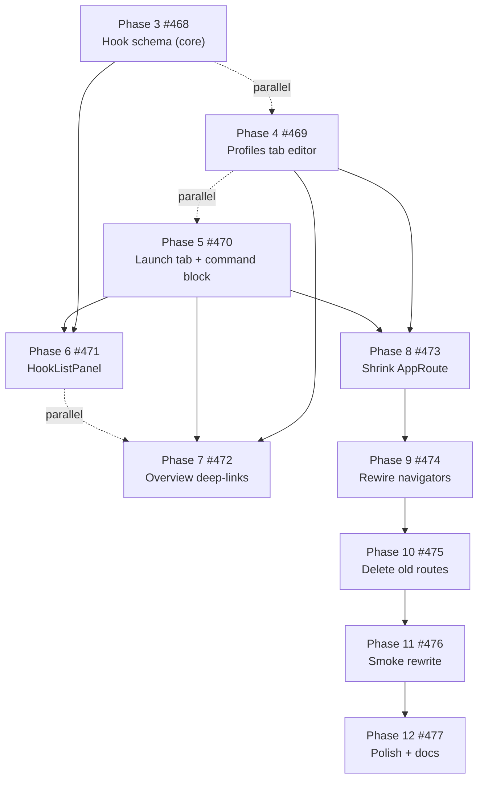

# CrossHook Roadmap

Living priority map for what to build next. Updated from `main` commit history, open GitHub issues, and PRD phase status (**2026-06-01**).

**How to use this file**

- Treat **P0** as the current sprint — work here before starting lower tiers unless blocked.
- Link child PRs with `Part of #478` (Hero Detail Consolidation) or `Closes #…` per [`.github/pull_request_template.md`](.github/pull_request_template.md).
- When a phase ships, check off the matching issue and update this file in the same PR (or a follow-up docs commit).
- Canonical detail lives in PRDs under `docs/prps/prds/`; this file is the executive view.

---

## Snapshot

| Area                          | Status                                                                                                                                                                                                                    |
| ----------------------------- | ------------------------------------------------------------------------------------------------------------------------------------------------------------------------------------------------------------------------- |
| **Latest release**            | [v0.2.11](https://github.com/yandy-r/crosshook/releases/tag/v0.2.11) (2026-04-15) — unreleased work on `main` includes Unified Desktop Phases 1–13 and Hero Detail Consolidation Phases 1–2                               |
| **Unified Desktop Redesign**  | **Shipped on `main`** — responsive three-pane shell, Hero Detail mode, ⌘K palette, context rail, console status bar, route reworks, responsive smoke, polish/a11y ([PRD](docs/prps/prds/unified-desktop-redesign.prd.md)) |
| **Hero Detail Consolidation** | **In progress** — Phases 1–2 done; Phases 3–12 open ([#478](https://github.com/yandy-r/crosshook/issues/478))                                                                                                             |
| **Open issues**               | 32 (see [Open issue inventory](#open-issue-inventory))                                                                                                                                                                    |
| **Open PRs**                  | 0                                                                                                                                                                                                                         |

---

## Recently completed (since v0.2.11)

These landed on `main` after the last tagged release and represent the bulk of recent effort.

### Unified Desktop Redesign (Phases 1–13)

| Phase | Deliverable                                                                | Issue / PR                                                                                                         |
| ----- | -------------------------------------------------------------------------- | ------------------------------------------------------------------------------------------------------------------ |
| 1     | `useBreakpoint`, layout unlock, `AppShell` extraction                      | —                                                                                                                  |
| 2     | Steel-blue token swap + legacy palette sweep                               | —                                                                                                                  |
| 3     | Sidebar variants + formalized Collections section                          | [#442](https://github.com/yandy-r/crosshook/issues/442)                                                            |
| 4     | Library cards + inspector rail                                             | [#443](https://github.com/yandy-r/crosshook/issues/443)                                                            |
| 5     | Hero Detail mode (replaces `GameDetailsModal`)                             | [#444](https://github.com/yandy-r/crosshook/issues/444)                                                            |
| 6     | ⌘K command palette                                                         | [#445](https://github.com/yandy-r/crosshook/issues/445)                                                            |
| 7     | Ultrawide context rail                                                     | [#446](https://github.com/yandy-r/crosshook/issues/446)                                                            |
| 8     | Console drawer → status bar on narrow/deck                                 | [#447](https://github.com/yandy-r/crosshook/issues/447)                                                            |
| 9     | Dashboard route rework (Health, Host Tools, Proton Manager, Compatibility) | [#448](https://github.com/yandy-r/crosshook/issues/448)                                                            |
| 10    | Install, Settings, Community, Discover route rework                        | [#449](https://github.com/yandy-r/crosshook/issues/449)                                                            |
| 11    | Profiles + Launch route rework (split then redesign)                       | [#450](https://github.com/yandy-r/crosshook/issues/450) / [#464](https://github.com/yandy-r/crosshook/pull/464)    |
| 12    | Responsive Playwright smoke + route sweep expansion                        | [#424](https://github.com/yandy-r/crosshook/issues/424) / [#424 PR](https://github.com/yandy-r/crosshook/pull/424) |
| 13    | Polish, accessibility, design-token docs                                   | [#452](https://github.com/yandy-r/crosshook/issues/452) / [#465](https://github.com/yandy-r/crosshook/pull/465)    |

### Hero Detail Consolidation (started)

| Phase | Deliverable                                                                                     | Issue / PR                                              | Status                                                   |
| ----- | ----------------------------------------------------------------------------------------------- | ------------------------------------------------------- | -------------------------------------------------------- |
| 1     | Extend Hero Detail panel contract (`profile`, `updateProfile`, `profileList`, `onSetActiveTab`) | [#466](https://github.com/yandy-r/crosshook/issues/466) | ✅ [#480](https://github.com/yandy-r/crosshook/pull/480) |
| 2     | Sidebar cleanup — drop Profiles/Launch from Game group; Favorites + Currently Playing filters   | [#467](https://github.com/yandy-r/crosshook/issues/467) | ✅ [#481](https://github.com/yandy-r/crosshook/pull/481) |

**Current code state after Phase 2:** sidebar Game group is Library-only; Favorites and Currently Playing filter Library via `library-filter` entries. Standalone `/profiles` and `/launch` routes **still exist** in `AppRoute`, `ProfilesPage.tsx`, and `LaunchPage.tsx` — deletion is Phases 8–10.

---

## P0 — Hero Detail Consolidation (active initiative)

**Tracker:** [#478](https://github.com/yandy-r/crosshook/issues/478)  
**PRD:** [`docs/prps/prds/unified-desktop-hero-detail-consolidation.prd.md`](docs/prps/prds/unified-desktop-hero-detail-consolidation.prd.md)

**Goal:** One per-game workspace in Hero Detail — fold profile editing and launch configuration into editable tabs, delete redundant `/profiles` and `/launch` routes.

**MVP (Phases 3–4):** schema + editable Profiles tab. After MVP, users see consolidation end-to-end even before Launch tab polish.

### Execution order

| Priority | Phase | Issue                                                   | Summary                                                                                                    | Depends on                |
| -------- | ----- | ------------------------------------------------------- | ---------------------------------------------------------------------------------------------------------- | ------------------------- |
| **Now**  | 3     | [#468](https://github.com/yandy-r/crosshook/issues/468) | Add `LaunchHook`, `HookStage`, `pre_launch_hooks` / `post_exit_hooks` to crosshook-core + round-trip tests | — (parallel with 4)       |
| **Now**  | 4     | [#469](https://github.com/yandy-r/crosshook/issues/469) | `HeroDetailProfilesTab` two-pane editor; card-click `selectProfile()`; autosave parity                     | #466 ✅                   |
| **Next** | 5     | [#470](https://github.com/yandy-r/crosshook/issues/470) | `HeroDetailLaunchTab` 3-section stack + `HighlightedCommandBlock`                                          | #466 ✅ (parallel with 4) |
| Then     | 6     | [#471](https://github.com/yandy-r/crosshook/issues/471) | `HookListPanel` live editor; "declared, not executed" banner                                               | #468, #470                |
| Then     | 7     | [#472](https://github.com/yandy-r/crosshook/issues/472) | Overview tab deep-link buttons → `onSetActiveTab`                                                          | #469, #470                |
| Then     | 8     | [#473](https://github.com/yandy-r/crosshook/issues/473) | Remove `'profiles'` / `'launch'` from `AppRoute` + `ROUTE_METADATA`                                        | #469, #470                |
| Then     | 9     | [#474](https://github.com/yandy-r/crosshook/issues/474) | Rewire all `onNavigate('profiles'\|'launch')` + palette handlers                                           | #473                      |
| Then     | 10    | [#475](https://github.com/yandy-r/crosshook/issues/475) | Delete `ProfilesPage`, `LaunchPage`, RTL tests, ContentArea cases                                          | #474                      |
| Then     | 11    | [#476](https://github.com/yandy-r/crosshook/issues/476) | Playwright smoke — Hero Detail flows, sidebar entries, regression guards                                   | #475                      |
| Finally  | 12    | [#477](https://github.com/yandy-r/crosshook/issues/477) | Polish, design-token docs, release-notes copy, dead-asset cleanup                                          | #476                      |

**Deferred from this PRD:** [#479](https://github.com/yandy-r/crosshook/issues/479) — Trainer tab full editor (hooks, injection config, log tail). Trainer tab stays read-only until that issue.

**Release candidate:** After Phase 11 passes CI, cut a release (`./scripts/prepare-release.sh`) so consolidation ships with updated smoke coverage.

---

## P1 — Release prep & issue hygiene

Work that unblocks a post-consolidation release or keeps trackers honest.

| Item                                                                        | Action                                                                                     | Notes                                                                        |
| --------------------------------------------------------------------------- | ------------------------------------------------------------------------------------------ | ---------------------------------------------------------------------------- |
| Tag release after consolidation                                             | Run `./scripts/prepare-release.sh` when Phases 3–11 land                                   | `main` has substantial UI work unreleased since v0.2.11                      |
| Close stale tracker [#451](https://github.com/yandy-r/crosshook/issues/451) | Mark complete — deliverable [#424](https://github.com/yandy-r/crosshook/issues/424) merged | Unified Desktop Phase 12 tracking issue left open                            |
| Refresh tracker [#78](https://github.com/yandy-r/crosshook/issues/78)       | Check off closed children (#63, #67, #70, #72–#75, etc.)                                   | Body still lists many completed items as open                                |
| Config history polish                                                       | [#123](https://github.com/yandy-r/crosshook/issues/123)                                    | Semantic diff, retention UI — infrastructure exists (`config_revisions` v11) |

---

## P2 — Platform & distribution

Lower urgency; strategic but not blocking the consolidation MVP.

| Issue                                                   | Summary                                             | Priority | Notes                                                                                              |
| ------------------------------------------------------- | --------------------------------------------------- | -------- | -------------------------------------------------------------------------------------------------- |
| [#210](https://github.com/yandy-r/crosshook/issues/210) | Flatpak Phase 4 — Flathub submission                | Low      | Depends on per-app isolation ([ADR-0004](docs/architecture/adr-0004-flatpak-per-app-isolation.md)) |
| [#206](https://github.com/yandy-r/crosshook/issues/206) | Submit CrossHook to Flathub                         | Low      | Child of Flatpak track                                                                             |
| [#69](https://github.com/yandy-r/crosshook/issues/69)   | Flatpak as secondary packaging format               | Low      | Partially addressed by v0.2.10-flatpak tag                                                         |
| [#233](https://github.com/yandy-r/crosshook/issues/233) | Auto-resolve GAMEID via umu-database + SQLite cache | Low      | `status:needs-triage`                                                                              |
| [#71](https://github.com/yandy-r/crosshook/issues/71)   | Lutris profile import                               | Low      | Migration aid                                                                                      |
| [#76](https://github.com/yandy-r/crosshook/issues/76)   | macOS port investigation (GPTK 2)                   | Low      | Out of core Linux scope                                                                            |

---

## P3 — Deferred / post-consolidation

Explicitly out of current scope. Revisit after #478 closes or when user demand surfaces.

### Unified Desktop deferred ([#426](https://github.com/yandy-r/crosshook/issues/426)–[#433](https://github.com/yandy-r/crosshook/issues/433))

| Issue | Topic                                                  |
| ----- | ------------------------------------------------------ |
| #426  | Alternate themes / theme switcher                      |
| #427  | Persisted layout prefs (inspector width, cmdk recency) |
| #428  | URL routing / deep links                               |
| #429  | New icon library                                       |
| #430  | Replace `react-resizable-panels`                       |
| #431  | Backend / Community marketplace scope                  |
| #432  | n-zone gamepad-nav refactor (4+ zones)                 |
| #433  | Hero Detail Media tab                                  |

### UMU / launcher deferred

| Issue                                                   | Topic                                          |
| ------------------------------------------------------- | ---------------------------------------------- |
| [#249](https://github.com/yandy-r/crosshook/issues/249) | Custom Proton fork "tinkerers" UX              |
| [#250](https://github.com/yandy-r/crosshook/issues/250) | Non-x86_64 architectures (umu container scope) |

### Hero Detail follow-up

| Issue                                                   | Topic                      |
| ------------------------------------------------------- | -------------------------- |
| [#479](https://github.com/yandy-r/crosshook/issues/479) | Trainer tab editor upgrade |

---

## Maintenance & blocked

| Issue                                                 | Summary                                                     | Status                                                                              |
| ----------------------------------------------------- | ----------------------------------------------------------- | ----------------------------------------------------------------------------------- |
| [#26](https://github.com/yandy-r/crosshook/issues/26) | Track upstream fix for vulnerable glib in Tauri Linux stack | `status:blocked` — monitor upstream; no local action until fix lands                |
| [#78](https://github.com/yandy-r/crosshook/issues/78) | Deep-research feature tracker                               | `status:in-progress` — most P0/P1/P2 children closed; refresh body or close tracker |

**Strategic principle** (from [#78](https://github.com/yandy-r/crosshook/issues/78)): invest in making the trainer-on-Linux workflow **reliable, diagnosable, and shareable** — depth over breadth. Hero Detail Consolidation aligns directly with this.

---

## Open issue inventory

All 32 open issues grouped by theme (2026-06-01).

### Hero Detail Consolidation — active (11)

#468, #469, #470, #471, #472, #473, #474, #475, #476, #477, #478 (tracker)

### Hero Detail — deferred (1)

#479

### Unified Desktop — deferred (8)

#426, #427, #428, #429, #430, #431, #432, #433

### Unified Desktop — stale tracker (1)

#451 — Phase 12 complete via #424; should close

### Deep research tracker (1)

#78

### Platform / build (6)

#26, #69, #71, #76, #206, #210

### UMU deferred (2)

#249, #250

### Other features (2)

#123, #233

---

## Key documents

| Document                                                                                                                             | Purpose                                                                  |
| ------------------------------------------------------------------------------------------------------------------------------------ | ------------------------------------------------------------------------ |
| [`docs/prps/prds/unified-desktop-redesign.prd.md`](docs/prps/prds/unified-desktop-redesign.prd.md)                                   | Shipped shell redesign — phase table + decisions                         |
| [`docs/prps/prds/unified-desktop-hero-detail-consolidation.prd.md`](docs/prps/prds/unified-desktop-hero-detail-consolidation.prd.md) | Active consolidation PRD — phases 3–12 detail                            |
| [`docs/internal-docs/design-tokens.md`](docs/internal-docs/design-tokens.md)                                                         | Token rules post Phase 13                                                |
| [`docs/research/additional-features/deep-research-report.md`](docs/research/additional-features/deep-research-report.md)             | Source for [#78](https://github.com/yandy-r/crosshook/issues/78) backlog |
| [`CHANGELOG.md`](CHANGELOG.md)                                                                                                       | Release history (git-cliff)                                              |
| [`AGENTS.md`](AGENTS.md)                                                                                                             | Agent/repo policy                                                        |

---

## Suggested next actions

1. **Start [#468](https://github.com/yandy-r/crosshook/issues/468)** (hook schema) and **[#469](https://github.com/yandy-r/crosshook/issues/469)** (Profiles tab) in parallel — both are on the critical path to MVP.
2. **Follow with [#470](https://github.com/yandy-r/crosshook/issues/470)** once panel contract from Phase 1 is stable in both new tabs.
3. **Run the serial chain #473 → #474 → #475** only after editable tabs ship — TypeScript will enumerate every stale `profiles`/`launch` callsite.
4. **Close [#451](https://github.com/yandy-r/crosshook/issues/451)** and **refresh [#78](https://github.com/yandy-r/crosshook/issues/78)** when convenient — reduces noise for anyone reading open issues.
5. **Cut a release** after Phase 11 smoke rewrite so users get Unified Desktop + consolidation without waiting for Phase 12 polish.
