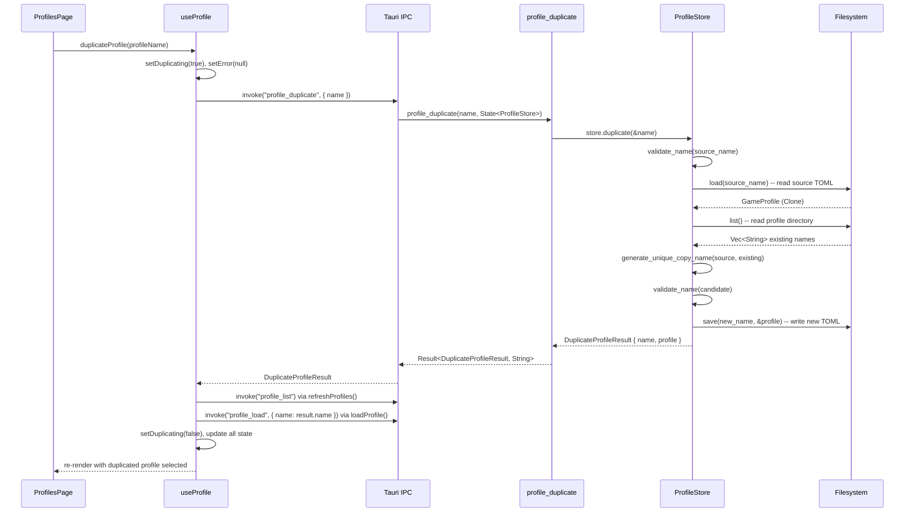
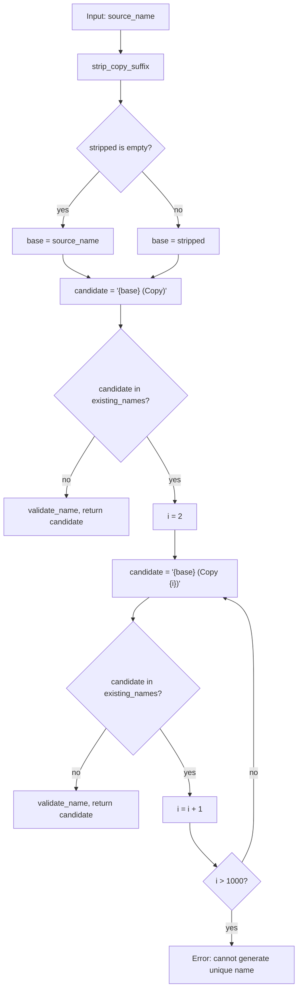
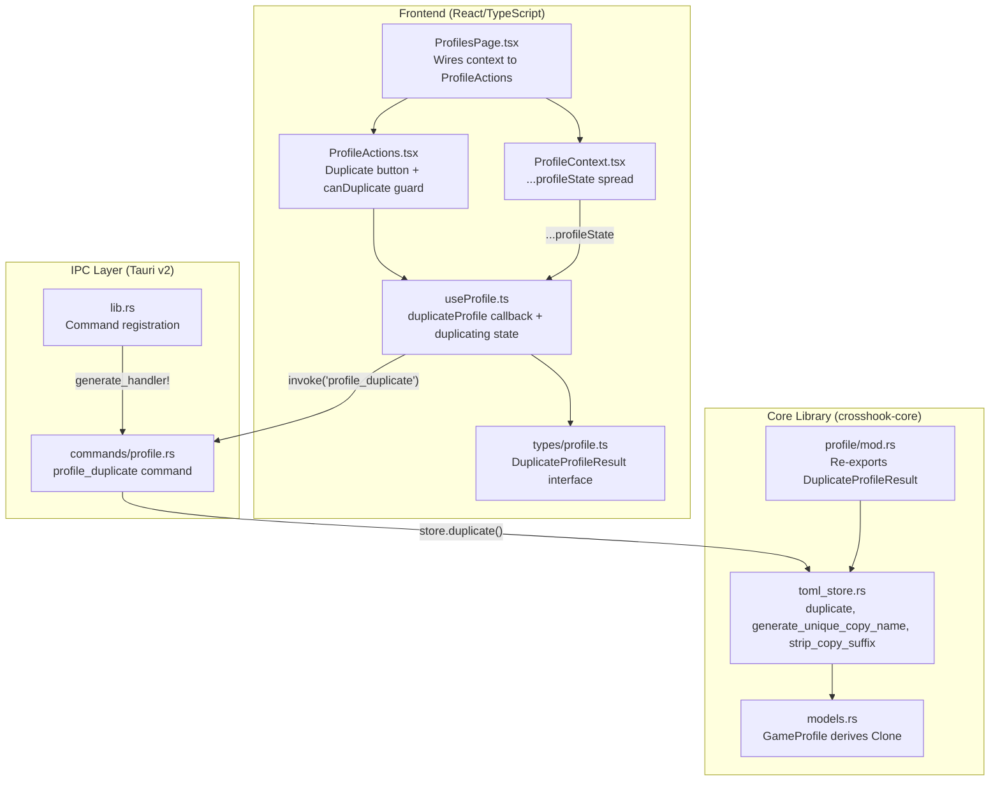

# Profile Duplication -- Architectural Analysis

Feature: Profile Duplication (#56)
Branch: `feat/duplicate-profile`

## Overview

Profile duplication allows users to clone an existing game profile under an automatically-generated unique name. The feature follows CrossHook's established three-layer architecture (core library, thin IPC commands, React hook/context frontend) and adds no new files, crates, or dependencies.

## Data Flow

### End-to-End Sequence



### Step-by-Step Walkthrough

1. **User clicks "Duplicate"** in `ProfileActions.tsx`. The button is guarded by `canDuplicate`, which requires `profileExists && !saving && !deleting && !loading && !duplicating`.

2. **`ProfilesPage.tsx`** calls `duplicateProfile(profileName)` from the `ProfileContext`.

3. **`useProfile.ts`** sets `duplicating = true`, clears any error, then calls `invoke<DuplicateProfileResult>('profile_duplicate', { name: sourceName })`.

4. **Tauri IPC** routes to the `profile_duplicate` command in `commands/profile.rs`, which is a one-line delegation: `store.duplicate(&name).map_err(map_error)`.

5. **`ProfileStore::duplicate()`** in `toml_store.rs` orchestrates the core logic:
   - Validates the source name via `validate_name()`.
   - Calls `self.load(source_name)` to read and deserialize the source TOML file.
   - Calls `self.list()` to get all existing profile names from disk.
   - Calls `generate_unique_copy_name()` to derive a collision-free name.
   - Calls `self.save(&new_name, &profile)` to write the cloned profile to a new TOML file.
   - Returns `DuplicateProfileResult { name, profile }`.

6. **Back in `useProfile.ts`**, after the IPC succeeds:
   - `refreshProfiles()` re-reads the profile list so the sidebar/dropdown reflects the new entry.
   - `loadProfile(result.name)` selects and loads the duplicate, syncing metadata (last-used profile, recent files) via `syncProfileMetadata()`.
   - `duplicating` is set back to `false`.

## Safety Mechanisms

### Overwrite Prevention

`ProfileStore::save()` calls `fs::write()` unconditionally -- it will silently overwrite any file at the target path. The `duplicate()` method defends against this by checking all existing names **before** calling `save()`:

```
toml_store.rs:190-200
    let profile = self.load(source_name)?;
    let existing_names = self.list()?;
    let new_name = Self::generate_unique_copy_name(source_name, &existing_names)?;
    self.save(&new_name, &profile)?;
```

`generate_unique_copy_name()` returns a name that is guaranteed to not appear in `existing_names`. Because `list()` reads from the filesystem immediately before name generation, the window for a TOCTOU race is narrow (no concurrent Tauri command execution on the same thread for synchronous commands).

### Name Validation

Every generated candidate passes through `validate_name()` before being returned. This rejects:
- Empty strings, `.`, `..`
- Absolute paths or names containing `/`, `\`, `:`
- Windows-reserved path characters (`<`, `>`, `"`, `|`, `?`, `*`)

This prevents path traversal attacks even if the name generation algorithm were somehow manipulated.

### Bounded Iteration

The search loop caps at 1000 iterations (`for i in 2..=1000`), preventing infinite loops. If all candidates are exhausted, it returns `ProfileStoreError::InvalidName` rather than hanging.

### UI Guards

The Duplicate button in `ProfileActions.tsx` is disabled when:
- `!canDuplicate` -- profile must exist on disk (no duplicating unsaved profiles)
- `duplicating` -- prevents double-clicks during the async operation
- Any of `saving`, `deleting`, or `loading` is active

## Name Generation Algorithm



### `strip_copy_suffix()` Details

The function strips existing copy suffixes to prevent name stacking (e.g., duplicating "Game (Copy)" produces "Game (Copy 2)" instead of "Game (Copy) (Copy)").

It recognizes these suffix patterns:
- `(Copy)` -- unnumbered copy
- `(Copy N)` -- numbered copy where N parses as `u32`

It does **not** strip suffixes that look similar but are not copy markers, for example `(Special Edition)` is preserved.

### Examples

| Source Name | Existing Names | Result |
|---|---|---|
| `MyGame` | `[MyGame]` | `MyGame (Copy)` |
| `MyGame` | `[MyGame, MyGame (Copy)]` | `MyGame (Copy 2)` |
| `MyGame (Copy)` | `[MyGame, MyGame (Copy)]` | `MyGame (Copy 2)` |
| `MyGame (Copy 2)` | `[MyGame, MyGame (Copy), MyGame (Copy 2)]` | `MyGame (Copy 3)` |
| `(Copy)` | `[(Copy)]` | `(Copy) (Copy)` |

The last case is an edge case: when `strip_copy_suffix("(Copy)")` returns an empty string, the function falls back to using the original name as the base to avoid producing a name that starts with a space.

## Integration Points

### Layer Architecture



### What Required Zero Changes

**`ProfileContext.tsx`** -- The context provider uses the spread pattern `...profileState` when constructing its value object. Because `useProfile()` already returns `duplicateProfile` and `duplicating` as part of `UseProfileResult`, the context automatically exposes them without any modification. This is the key design leverage that made the feature's frontend integration lightweight.

### Dependencies on Existing Primitives

The `duplicate()` method composes three existing `ProfileStore` operations with no new filesystem or serialization code:

| Primitive | Role in Duplication |
|---|---|
| `validate_name()` | Guards source name and every generated candidate |
| `load()` | Reads and deserializes the source profile TOML |
| `list()` | Enumerates existing names for collision detection |
| `save()` | Writes the cloned profile under the new name |

### Type Flow Across Boundaries

```
Rust: DuplicateProfileResult { name: String, profile: GameProfile }
  -- serde Serialize -->
Tauri IPC (JSON)
  -- invoke<DuplicateProfileResult> -->
TypeScript: DuplicateProfileResult { name: string; profile: GameProfile }
```

Both sides define the same shape. The Rust struct derives `Serialize` and `Deserialize`; the TypeScript interface mirrors it in `types/profile.ts`.

## Test Coverage

The feature includes seven unit tests in `toml_store.rs`:

| Test | Validates |
|---|---|
| `test_strip_copy_suffix` | Suffix pattern recognition (7 cases) |
| `test_duplicate_basic` | First copy produces `(Copy)` suffix |
| `test_duplicate_increments_on_conflict` | Collision advances to `(Copy 2)` |
| `test_duplicate_of_copy` | Duplicating a copy strips suffix before incrementing |
| `test_duplicate_copy_suffix_only_name_keeps_non_empty_base` | Edge case: name that is itself `(Copy)` |
| `test_duplicate_preserves_all_fields` | All GameProfile sections survive round-trip |
| `test_duplicate_source_not_found` | Missing source returns `ProfileStoreError::NotFound` |

## Key Source Files

All paths relative to `src/crosshook-native/`:

| File | Lines of Interest | Role |
|---|---|---|
| `crates/crosshook-core/src/profile/toml_store.rs` | 60-64, 190-229, 264-277 | `DuplicateProfileResult`, `duplicate()`, `generate_unique_copy_name()`, `strip_copy_suffix()` |
| `crates/crosshook-core/src/profile/models.rs` | 33 | `GameProfile` derives `Clone` |
| `crates/crosshook-core/src/profile/mod.rs` | 23 | Re-exports `DuplicateProfileResult` |
| `src-tauri/src/commands/profile.rs` | 126-131 | `profile_duplicate` Tauri command |
| `src-tauri/src/lib.rs` | 92 | Command registered in `generate_handler!` |
| `src/hooks/useProfile.ts` | 39-40, 327, 557-576 | `duplicateProfile` callback, `duplicating` state |
| `src/types/profile.ts` | 56-59 | `DuplicateProfileResult` TypeScript interface |
| `src/components/ProfileActions.tsx` | 1-62 | Duplicate button with `canDuplicate` guard |
| `src/components/pages/ProfilesPage.tsx` | 70, 163 | `canDuplicate` derivation, `onDuplicate` wiring |
| `src/context/ProfileContext.tsx` | 51-54 | `...profileState` spread (zero changes needed) |
