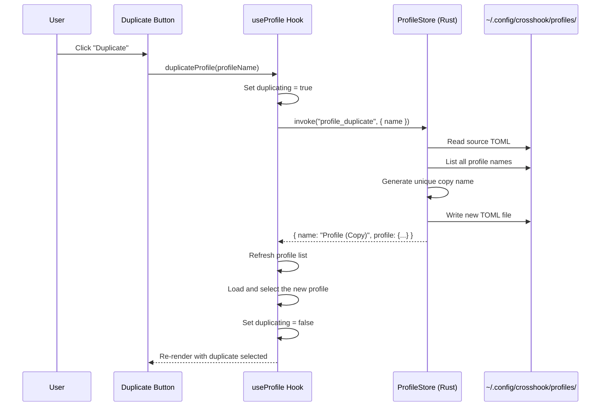

# Profile Duplication

CrossHook allows you to duplicate an existing game profile with a single click. The duplicate is saved to disk immediately under an auto-generated unique name, preserving every field from the original. This lets you create variant configurations -- different trainers, optimization presets, Proton versions, or launch methods -- without rebuilding a profile from scratch.

## Table of Contents

- [Overview](#overview)
- [Getting started](#getting-started)
- [How duplication works](#how-duplication-works)
- [Name generation](#name-generation)
- [What gets copied](#what-gets-copied)
- [What does not get copied](#what-does-not-get-copied)
- [Using the duplicate](#using-the-duplicate)
- [Gamepad and Steam Deck usage](#gamepad-and-steam-deck-usage)
- [Troubleshooting](#troubleshooting)
- [Related guides](#related-guides)

## Overview

The Duplicate button sits in the profile action bar between Save and Delete. When you click it, CrossHook:

1. Reads the currently selected profile from disk.
2. Generates a unique name based on the original (e.g., "Elden Ring (Copy)").
3. Writes a new TOML file with the same contents under that name.
4. Refreshes the profile list and auto-selects the new duplicate.

The duplicate is an independent profile. Editing or deleting it has no effect on the original, and vice versa.

## Getting Started

1. Open CrossHook and navigate to the **Profiles** tab.
2. Select a saved profile from the profile selector dropdown.
3. Click **Duplicate** in the action bar below the profile form.
4. The profile list updates and the new profile is selected automatically.
5. Rename the duplicate, make your changes, and click **Save**.

That is the entire workflow. The rest of this guide covers the details.

## How Duplication Works

### Button state

The Duplicate button is enabled when all of the following are true:

- A profile that exists on disk is selected (`profileExists`).
- No save, delete, load, or duplicate operation is currently in progress.

The button is disabled and cannot be clicked when any of those conditions is not met. While duplication is in progress, the button text changes to "Duplicating..." and remains disabled until the operation completes.

### Execution flow



### What happens on disk

Profiles are stored as TOML files in `~/.config/crosshook/profiles/`. When you duplicate "Elden Ring", CrossHook creates a new file at:

```
~/.config/crosshook/profiles/Elden Ring (Copy).toml
```

The file contains the same TOML content as the original. Both files are fully independent after duplication.

## Name Generation

CrossHook generates a unique name for each duplicate to prevent overwriting existing profiles. The naming follows a predictable pattern.

### Basic rules

| Scenario | Source Name | Generated Name |
|---|---|---|
| First duplicate | `Elden Ring` | `Elden Ring (Copy)` |
| "(Copy)" already exists | `Elden Ring` | `Elden Ring (Copy 2)` |
| "(Copy)" and "(Copy 2)" exist | `Elden Ring` | `Elden Ring (Copy 3)` |

### Suffix stripping

When you duplicate a profile that already has a copy suffix, CrossHook strips the suffix before generating the new name. This prevents names from stacking:

| Source Name | Existing Names | Result |
|---|---|---|
| `Elden Ring (Copy)` | `Elden Ring`, `Elden Ring (Copy)` | `Elden Ring (Copy 2)` |
| `Elden Ring (Copy 2)` | `Elden Ring`, `Elden Ring (Copy)`, `Elden Ring (Copy 2)` | `Elden Ring (Copy 3)` |

Without suffix stripping, duplicating "Elden Ring (Copy)" would produce "Elden Ring (Copy) (Copy)" -- an ugly and confusing name. CrossHook recognizes `(Copy)` and `(Copy N)` suffixes and removes them before generating the next candidate.

Suffixes that are not copy markers are preserved. For example, duplicating "Elden Ring (Special Edition)" produces "Elden Ring (Special Edition) (Copy)", because "(Special Edition)" is not a recognized copy suffix.

### Edge cases

- **Profile named "(Copy)"**: Because stripping the suffix would produce an empty base name, CrossHook falls back to using the original name as the base. The result is `(Copy) (Copy)`.
- **Upper limit**: CrossHook tries up to 1000 numbered candidates (`(Copy 2)` through `(Copy 1000)`). If all are taken, it reports an error. In practice you will never hit this limit.

### Name validation

Every generated name must pass CrossHook's profile name validation before it is used. Invalid characters that would cause filesystem problems are rejected:

- Path separators: `/`, `\`
- Reserved characters: `<`, `>`, `:`, `"`, `|`, `?`, `*`
- Reserved names: `.`, `..`, empty strings

## What Gets Copied

Duplication performs a deep copy of all profile fields. The duplicate is identical to the original in every respect:

| Section | Fields |
|---|---|
| **Game** | Game name, executable path |
| **Trainer** | Trainer path, trainer kind (FLiNG, WeMod, etc.), loading mode (source directory or copy to prefix) |
| **Injection** | DLL paths, per-DLL inject-on-launch flags |
| **Steam** | Enabled flag, App ID, compatdata path, Proton path, launcher icon path, launcher display name |
| **Runtime** | Prefix path, Proton path, working directory |
| **Launch** | Launch method (steam_applaunch, proton_run, native), launch optimization toggles |

## What Does NOT Get Copied

- **Exported launchers**: If you exported a launcher (`.sh` script and `.desktop` entry) from the original profile, the duplicate does not inherit those files. You must export a new launcher from the duplicate if you need one.
- **Community provenance**: Community profiles downloaded from taps are plain TOML files after installation. No community metadata is stored in the profile, so there is nothing extra to copy or omit.

The duplicate starts as a clean profile with no launcher files on disk. This is intentional -- launcher files embed the profile name and slug in their content, so sharing them between profiles would produce incorrect results.

## Using the Duplicate

After duplication, the new profile is loaded and selected in the editor. A typical next step is to rename it and adjust the fields you want to vary.

### Common use cases

**Testing a different Proton version**: Duplicate your working profile, change the Proton path in the duplicate to a different version (e.g., GE-Proton), and test whether the game or trainer works better.

**Switching trainer loading modes**: If you normally run trainers from their source directory, duplicate the profile and switch the duplicate to "Copy into prefix" mode to test whether a problematic trainer works better when staged.

**Keeping a backup before major changes**: Before overhauling a profile's Steam settings or launch optimizations, duplicate it first. If the changes do not work out, the original is untouched.

**Creating per-game-version profiles**: When a game update breaks trainer compatibility, duplicate the profile and point the duplicate at a different trainer version. Keep both so you can switch back when the trainer is updated.

### Renaming the duplicate

After duplicating, the profile name field shows the auto-generated name (e.g., "Elden Ring (Copy)"). To rename:

1. Edit the profile name field at the top of the form.
2. Click **Save**.

CrossHook saves the profile under the new name. If the original copy-named file is no longer needed, you can delete it manually from `~/.config/crosshook/profiles/` or use the profile rename feature.

## Gamepad and Steam Deck Usage

The Duplicate button supports full gamepad navigation through CrossHook's controller input system:

1. Use the **D-pad** to navigate to the Duplicate button in the profile action bar.
2. Press **A** (South button) to activate duplication.
3. The operation completes and the duplicate profile is loaded.
4. Navigate to the profile name field and press **A** to edit it. On Steam Deck, this opens the Steam Input on-screen keyboard.
5. Type a new name, confirm, and save.

The button follows the same focus styling and navigation order as Save and Delete, so the interaction feels consistent with the rest of the profile editor.

## Troubleshooting

### The Duplicate button is disabled

The button requires a saved profile to be selected. Check these conditions:

- **No profile selected**: Select a profile from the dropdown first.
- **Profile does not exist on disk**: If you typed a new name that has not been saved yet, there is nothing to duplicate. Save the profile first, then duplicate.
- **Another operation is in progress**: Wait for any ongoing save, delete, load, or duplicate operation to finish.

### Error banner appears after clicking Duplicate

If an error banner appears below the action bar, it means the backend operation failed. Common causes:

| Error Message | Cause | Fix |
|---|---|---|
| `profile file not found: ...` | The source profile was deleted between selection and duplication (rare). | Refresh the profile list and select a valid profile. |
| IO error (permission denied, disk full) | CrossHook cannot write to `~/.config/crosshook/profiles/`. | Check that the directory exists and is writable. Verify available disk space. |
| `invalid profile name: ...` | The generated name contains invalid characters. This should not happen under normal use. | Report this as a bug -- it indicates a name generation edge case. |

### The duplicate has the wrong content

Duplication reads the profile from disk, not from the editor form. If you made changes in the editor without saving, the duplicate reflects the last saved version on disk, not your unsaved edits. Save first, then duplicate, to ensure the duplicate matches what you see in the editor.

### The profile list did not update

After a successful duplication, CrossHook refreshes the profile list automatically. If the new profile does not appear:

1. Click the **Refresh** button in the Profile panel header.
2. Check `~/.config/crosshook/profiles/` to confirm the file was created.

### Exported launcher is missing on the duplicate

This is expected behavior. Exported launchers are not copied during duplication. If you need a launcher for the duplicate, open the Launcher Export panel and export a new one.

## Related Guides

- [Steam / Proton trainer workflow](steam-proton-trainer-launch.doc.md) -- Covers launch methods, auto-populate, launcher export, and the console view
- [CrossHook quickstart](../getting-started/quickstart.md) -- First-time setup and basic usage
