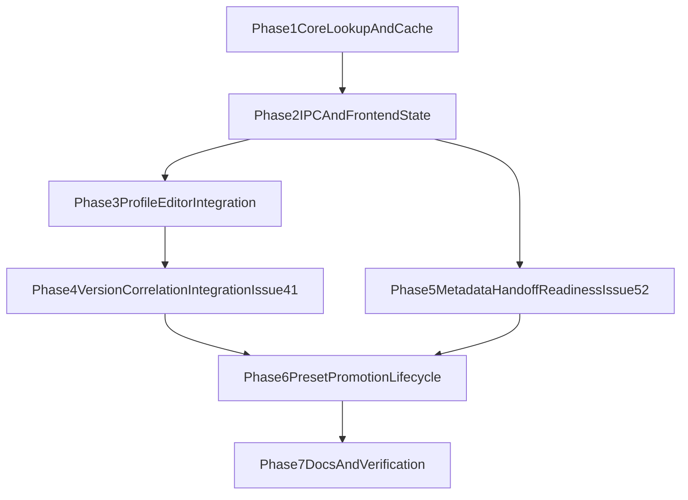

# ProtonDB Lookup Implementation Plan

CrossHook should add ProtonDB guidance through the existing profile-editor and metadata architecture instead of inventing a parallel subsystem. The implementation needs a new `crosshook-core::protondb` module for exact-tier modeling, cache-backed remote lookup, and safe recommendation normalization; a thin Tauri command that exposes that DTO; and a dedicated UI card placed beside the Steam App ID workflow in the profile editor. Because ProtonDB’s richer report feed is undocumented and CrossHook’s existing `CompatibilityRating` is lossy, the plan deliberately sequences exact-tier and summary/cache work before UI composition so the feature can still ship a stable rating path even when richer aggregation degrades. Recommendation application is explicitly constrained to safe copy/apply actions that reuse existing `launch.custom_env_vars` and Steam launch-option flows rather than injecting raw remote strings into the launch pipeline.

## Critically Relevant Files and Documentation

- /src/crosshook-native/crates/crosshook-core/src/lib.rs: export surface for the new ProtonDB core module
- /src/crosshook-native/crates/crosshook-core/src/metadata/mod.rs: cache/store API used by new lookup logic
- /src/crosshook-native/crates/crosshook-core/src/metadata/cache_store.rs: existing external-cache implementation to reuse
- /src/crosshook-native/crates/crosshook-core/src/profile/community_schema.rs: legacy compatibility enum that cannot represent exact ProtonDB tiers
- /src/crosshook-native/src-tauri/src/commands/steam.rs: thin command pattern for metadata-driven lookups
- /src/crosshook-native/src-tauri/src/commands/version.rs: thin command pattern plus soft metadata-state precedent
- /src/crosshook-native/src-tauri/src/commands/mod.rs: command registry
- /src/crosshook-native/src-tauri/src/lib.rs: invoke registration and shared app-state wiring
- /src/crosshook-native/src/components/ProfileFormSections.tsx: profile-editor Steam/App ID section and mutation wiring
- /src/crosshook-native/src/components/pages/ProfilesPage.tsx: selected-profile context and existing version metadata
- /src/crosshook-native/src/components/SteamLaunchOptionsPanel.tsx: reusable copy-action surface for launch-option suggestions
- /src/crosshook-native/src/components/CustomEnvironmentVariablesSection.tsx: existing safe apply path for env-var merges
- /src/crosshook-native/src/styles/theme.css: compatibility badge and panel styling
- /docs/plans/protondb-lookup/feature-spec.md: external-API findings, product rules, and resolved planning decisions
- /docs/getting-started/quickstart.md: user-facing profile-editor / Steam App ID documentation
- /docs/features/steam-proton-trainer-launch.doc.md: user-facing launch-setting documentation

## Implementation Plan

### Phase 1: Core Lookup and Cache Boundary

#### Task 1.1: Define the backend ProtonDB contract and exact-tier model Depends on [none]

**READ THESE BEFORE TASK**

- /src/crosshook-native/crates/crosshook-core/src/lib.rs
- /src/crosshook-native/crates/crosshook-core/src/profile/community_schema.rs
- /src/crosshook-native/crates/crosshook-core/src/metadata/cache_store.rs
- /docs/plans/protondb-lookup/feature-spec.md

**Instructions**

Files to Create

- /src/crosshook-native/crates/crosshook-core/src/protondb/mod.rs
- /src/crosshook-native/crates/crosshook-core/src/protondb/models.rs

Files to Modify

- /src/crosshook-native/crates/crosshook-core/src/lib.rs

Create a feature-local ProtonDB module that defines the exact contract CrossHook will use end to end. Introduce a dedicated `ProtonDbTier` enum that preserves exact remote tiers instead of widening or abusing `CompatibilityRating`; keep any mapping to the legacy community compatibility scale as an explicit helper, not the source of truth. Define compact normalized DTOs for cached lookup state, stale/offline metadata, and recommendation groups so later IPC/UI work has a stable shape. Call out in code comments and type naming that remote notes and launch options are untrusted advisory data.

#### Task 1.2: Implement cache-backed ProtonDB fetch and safe recommendation normalization Depends on [1.1]

**READ THESE BEFORE TASK**

- /src/crosshook-native/crates/crosshook-core/src/metadata/mod.rs
- /src/crosshook-native/crates/crosshook-core/src/metadata/cache_store.rs
- /src/crosshook-native/src-tauri/src/commands/version.rs
- /docs/plans/protondb-lookup/research-external.md

**Instructions**

Files to Create

- /src/crosshook-native/crates/crosshook-core/src/protondb/client.rs
- /src/crosshook-native/crates/crosshook-core/src/protondb/aggregation.rs

Files to Modify

- /src/crosshook-native/crates/crosshook-core/Cargo.toml
- /src/crosshook-native/crates/crosshook-core/src/protondb/mod.rs

Add the HTTP client dependency in `crosshook-core` and build a read-through lookup path that first checks `external_cache_entries`, then fetches the stable ProtonDB summary endpoint, and finally attempts richer recommendation aggregation behind a summary-first fallback boundary. Use namespaced cache keys keyed by Steam App ID, explicit timeouts, and conservative TTLs. Normalize remote payloads into the compact DTO from Task `1.1`, persist normalized payloads only, and never persist or return raw launch strings as executable configuration. If richer report aggregation cannot be resolved robustly from the Steam App ID, keep the lookup usable with summary-only data and a degraded recommendation state.

#### Task 1.3: Add backend tests for tier mapping, cache fallback, and safe suggestion parsing Depends on [1.2]

**READ THESE BEFORE TASK**

- /src/crosshook-native/crates/crosshook-core/src/steam/manifest.rs
- /src/crosshook-native/crates/crosshook-core/src/metadata/mod.rs
- /docs/plans/protondb-lookup/research-security.md

**Instructions**

Files to Create

- /src/crosshook-native/crates/crosshook-core/src/protondb/tests.rs

Files to Modify

- /src/crosshook-native/crates/crosshook-core/src/protondb/mod.rs

Add focused Rust coverage around the highest-risk feature rules: exact-tier decoding, unknown-tier fallback, stale-cache fallback when the network fails, empty App ID short-circuit behavior, and recommendation parsing that accepts only safe supported `KEY=value` env fragments. Include tests proving that unsupported raw launch strings remain copy-only advisory data and never mutate a launch request directly.

### Phase 2: IPC and Frontend State

#### Task 2.1: Expose ProtonDB lookup as a thin Tauri command Depends on [1.2]

**READ THESE BEFORE TASK**

- /src/crosshook-native/src-tauri/src/commands/steam.rs
- /src/crosshook-native/src-tauri/src/commands/version.rs
- /src/crosshook-native/src-tauri/src/commands/mod.rs
- /src/crosshook-native/src-tauri/src/lib.rs

**Instructions**

Files to Create

- /src/crosshook-native/src-tauri/src/commands/protondb.rs

Files to Modify

- /src/crosshook-native/src-tauri/src/commands/mod.rs
- /src/crosshook-native/src-tauri/src/lib.rs

Add a `snake_case` Tauri command such as `protondb_lookup` that accepts the Steam App ID plus an optional `force_refresh` flag and delegates everything else to `crosshook-core`. Keep error conversion thin, return typed Serde-friendly DTOs, and reuse injected `MetadataStore` state rather than opening any new database handles. Do not move fetch or parsing logic into the Tauri layer.

#### Task 2.2: Add frontend ProtonDB types and lookup hook Depends on [2.1]

**READ THESE BEFORE TASK**

- /src/crosshook-native/src/types/version.ts
- /src/crosshook-native/src/types/index.ts
- /src/crosshook-native/src/hooks/useProfileHealth.ts
- /src/crosshook-native/src/context/ProfileContext.tsx

**Instructions**

Files to Create

- /src/crosshook-native/src/types/protondb.ts
- /src/crosshook-native/src/hooks/useProtonDbLookup.ts

Files to Modify

- /src/crosshook-native/src/types/index.ts

Mirror the backend DTOs exactly in TypeScript and wrap the new command in an invoke-driven hook with stable `idle`, `loading`, `ready`, `stale`, and `unavailable` states. Make the hook app-id-driven, ignore blank IDs without error, and expose a refresh function plus enough metadata for the UI to distinguish live vs cached results. Keep browser fetches out of scope; the hook should only talk to the Tauri command.

#### Task 2.3: Extend theme styling for exact ProtonDB tiers and degraded states Depends on [none]

**READ THESE BEFORE TASK**

- /src/crosshook-native/src/styles/theme.css
- /src/crosshook-native/src/components/CompatibilityViewer.tsx
- /docs/plans/protondb-lookup/research-ux.md

**Instructions**

Files to Create

- [none]

Files to Modify

- /src/crosshook-native/src/styles/theme.css

Add dedicated ProtonDB badge and panel classes for exact tiers such as `platinum`, `gold`, `silver`, `bronze`, and `borked`, plus neutral stale/unavailable/loading presentation. Do not repurpose the existing `crosshook-compatibility-badge--working/partial/broken` classes because those semantics are already used by other features. Keep the new styling aligned with the current `crosshook-*` design system and readable in the compact profile editor layout.

### Phase 3: Profile Editor Integration

#### Task 3.1: Build a dedicated ProtonDB lookup card component Depends on [2.2, 2.3]

**READ THESE BEFORE TASK**

- /src/crosshook-native/src/components/ProfileFormSections.tsx
- /src/crosshook-native/src/components/SteamLaunchOptionsPanel.tsx
- /src/crosshook-native/src/components/CustomEnvironmentVariablesSection.tsx
- /docs/plans/protondb-lookup/research-ux.md

**Instructions**

Files to Create

- /src/crosshook-native/src/components/ProtonDbLookupCard.tsx

Files to Modify

- [none]

Build a self-contained advisory panel component that consumes the hook state and renders exact tier, confidence/score/report count, freshness, source link, and grouped recommendation actions. The component should support a neutral no-App-ID state, inline loading, stale-cache fallback, and soft unavailable messaging. Keep remote note text escaped/plain, make raw launch strings copy-only, and surface apply actions only for normalized suggestions that can be merged safely into existing CrossHook fields.

#### Task 3.2: Compose the ProtonDB card into the profile editor flow Depends on [3.1, 2.1]

**READ THESE BEFORE TASK**

- /src/crosshook-native/src/components/pages/ProfilesPage.tsx
- /src/crosshook-native/src/components/ProfileFormSections.tsx
- /src/crosshook-native/src/context/ProfileContext.tsx
- /docs/getting-started/quickstart.md

**Instructions**

Files to Create

- [none]

Files to Modify

- /src/crosshook-native/src/components/ProfileFormSections.tsx
- /src/crosshook-native/src/components/pages/ProfilesPage.tsx

Mount the new card near the Steam App ID / Auto-Populate section so the lookup appears in the same workflow where users establish Steam metadata. Feed it the selected profile’s App ID and any adjacent context that improves the copy, such as the current trainer version. Keep the feature available for profiles that have a meaningful Steam App ID even if they are not strictly `steam_applaunch`, and make sure lookup failures do not pollute the rest of the page error state.

#### Task 3.3: Implement explicit copy/apply merge behavior for supported suggestions Depends on [3.1]

**READ THESE BEFORE TASK**

- /src/crosshook-native/src/components/CustomEnvironmentVariablesSection.tsx
- /src/crosshook-native/src/components/SteamLaunchOptionsPanel.tsx
- /src/crosshook-native/src/types/profile.ts
- /docs/plans/protondb-lookup/research-security.md

**Instructions**

Files to Create

- /src/crosshook-native/src/utils/protondb.ts

Files to Modify

- /src/crosshook-native/src/components/ProtonDbLookupCard.tsx
- /src/crosshook-native/src/components/ProfileFormSections.tsx

Implement helper logic that can merge supported recommended env vars into `launch.custom_env_vars` without silently discarding existing user choices. When keys collide, require explicit per-key overwrite confirmation before mutation. Keep unsupported launch strings and free-form notes copy-only; they may be shown and copied, but they must not mutate the profile model or launch request implicitly.

### Phase 4: Version-Correlation Integration (`#41`)

#### Task 4.1: Join ProtonDB panel state with version-correlation signals Depends on [3.2]

**READ THESE BEFORE TASK**

- /src/crosshook-native/src/components/pages/ProfilesPage.tsx
- /src/crosshook-native/src/hooks/useProfileHealth.ts
- /src/crosshook-native/src-tauri/src/commands/version.rs
- /docs/research/additional-features/implementation-guide.md

**Instructions**

Files to Create

- [none]

Files to Modify

- /src/crosshook-native/src/components/pages/ProfilesPage.tsx
- /src/crosshook-native/src/components/ProtonDbLookupCard.tsx
- /src/crosshook-native/src/types/protondb.ts

Compose version-correlation context alongside ProtonDB lookup state so the panel can indicate when recommendations are likely stale after recent game updates. Keep this contextual warning advisory and local to the ProtonDB card so version drift cannot block profile editing, saving, or launch validation.

#### Task 4.2: Add regression coverage for version-aware ProtonDB messaging Depends on [4.1]

**READ THESE BEFORE TASK**

- /src/crosshook-native/src/components/ProtonDbLookupCard.tsx
- /src/crosshook-native/src/hooks/useProtonDbLookup.ts
- /docs/plans/protondb-lookup/feature-spec.md

**Instructions**

Files to Create

- [none]

Files to Modify

- /tasks/todo.md

Add explicit verification scenarios for version drift + ProtonDB combinations: up-to-date version, unknown version, and stale game build relative to cached ProtonDB guidance. Record expected user-visible behavior and non-blocking constraints in `tasks/todo.md`.

### Phase 5: Metadata Handoff Readiness (`#52`)

#### Task 5.1: Define cross-feature Steam App ID and cache namespace contract Depends on [2.2, 4.1]

**READ THESE BEFORE TASK**

- /src/crosshook-native/crates/crosshook-core/src/metadata/cache_store.rs
- /src/crosshook-native/src/types/protondb.ts
- /docs/research/additional-features/deep-research-report.md
- /docs/research/additional-features/implementation-guide.md

**Instructions**

Files to Create

- [none]

Files to Modify

- /docs/plans/protondb-lookup/feature-spec.md
- /docs/plans/protondb-lookup/shared.md

Lock the canonical Steam App ID ownership and namespace policy (`protondb:*`) used by issue `#53` so issue `#52` can integrate metadata/cover-art features without introducing duplicate app identifiers, parallel caches, or conflicting source attribution rules.

#### Task 5.2: Document explicit integration boundary for issue `#52` Depends on [5.1]

**READ THESE BEFORE TASK**

- /docs/plans/protondb-lookup/feature-spec.md
- /docs/plans/protondb-lookup/research-business.md
- /docs/plans/protondb-lookup/research-external.md

**Instructions**

Files to Create

- [none]

Files to Modify

- /docs/plans/protondb-lookup/research-recommendations.md
- /docs/plans/protondb-lookup/research-business.md

Document an explicit in-scope/out-of-scope contract: issue `#53` owns lookup, normalization, caching, and advisory UI; issue `#52` may reuse Steam App ID and provenance fields but must not duplicate or reimplement ProtonDB fetch logic. Ensure no planning language implies a deferred hidden dependency.

### Phase 6: Preset Promotion Lifecycle

#### Task 6.1: Define promotion eligibility for advisory recommendations Depends on [3.3, 4.1]

**READ THESE BEFORE TASK**

- /docs/plans/protondb-lookup/feature-spec.md
- /docs/plans/protondb-lookup/research-recommendations.md
- /src/crosshook-native/src/components/CustomEnvironmentVariablesSection.tsx

**Instructions**

Files to Create

- [none]

Files to Modify

- /docs/plans/protondb-lookup/feature-spec.md
- /docs/plans/protondb-lookup/research-recommendations.md

Define deterministic criteria for promoting recommendations into preset candidates (for example repeated acceptance without overwrite conflicts, supported env-var-only payloads, and no unsafe launch-string dependency). Keep promotion opt-in and reviewable, not automatic.

#### Task 6.2: Define preset-candidate persistence and rollback guidance Depends on [6.1]

**READ THESE BEFORE TASK**

- /docs/plans/protondb-lookup/feature-spec.md
- /docs/research/additional-features/implementation-guide.md

**Instructions**

Files to Create

- [none]

Files to Modify

- /docs/plans/protondb-lookup/parallel-plan.md
- /docs/plans/protondb-lookup/research-recommendations.md

Specify where preset candidates are tracked, how updates are reviewed, and how candidate rollback behaves when new data or version-correlation context invalidates prior guidance.

### Phase 7: Docs and Verification

#### Task 7.1: Update user-facing docs for ProtonDB lookup behavior Depends on [6.2]

**READ THESE BEFORE TASK**

- /docs/getting-started/quickstart.md
- /docs/features/steam-proton-trainer-launch.doc.md
- /docs/plans/protondb-lookup/feature-spec.md

**Instructions**

Files to Create

- [none]

Files to Modify

- /docs/getting-started/quickstart.md
- /docs/features/steam-proton-trainer-launch.doc.md

Document where the ProtonDB lookup appears, what exact tiers mean, how cached/stale/unavailable states behave, and how copy/apply actions interact with the existing launch-settings model. Keep the docs explicit that the feature is advisory and that remote outages do not block the profile editor.

#### Task 7.2: Run verification and record the planning closeout Depends on [1.3, 2.1, 3.3, 4.2, 5.2, 6.2, 7.1]

**READ THESE BEFORE TASK**

- /AGENTS.md
- /tasks/todo.md
- /docs/plans/protondb-lookup/parallel-plan.md

**Instructions**

Files to Create

- [none]

Files to Modify

- /tasks/todo.md

Run `cargo test --manifest-path src/crosshook-native/Cargo.toml -p crosshook-core`, `cargo test --manifest-path src/crosshook-native/Cargo.toml -p crosshook-native --no-run`, and `npm exec --yes tsc -- --noEmit` in `/src/crosshook-native`. Record manual regression checks for empty App ID, cache-hit and stale-cache states, remote timeout/unavailable behavior, exact-tier rendering, version-correlation messaging, metadata-boundary behavior, and supported suggestion copy/apply flows. Update `tasks/todo.md` with the implementation review and close each identified risk with either a passing check or a linked owner-tracked issue.

## Dependency Diagram

## Planning Completion Checklist

- [ ] No unresolved-decision sections remain in ProtonDB planning docs.
- [ ] No deferred/future-only bullets remain unbound to concrete phases and tasks.
- [ ] `#41` integration work is represented by explicit tasks and verification scenarios.
- [ ] `#52` handoff boundaries are explicit and non-duplicative.
- [ ] Preset promotion flow has eligibility, persistence, and rollback guidance.

## Advice

- Resolve the exact-tier contract before any UI copy or styling work; otherwise the feature will oscillate between ProtonDB’s real scale and CrossHook’s existing `working/partial` semantics.
- Prefer `external_cache_entries` over a new schema until normalized payloads or query patterns prove the generic cache insufficient.
- Treat `launchOptions` as advisory strings, not as executable configuration; only whitelisted `KEY=value` suggestions should ever become apply actions.
- Keep summary lookup and richer recommendation aggregation separate so the stable rating path survives if the undocumented report feed changes.
- Keep issue boundaries explicit: `#53` owns ProtonDB lookup and advisory normalization, while `#52` reuses contracts without forking fetch/cache logic.
- `ProfileFormSections.tsx`, `theme.css`, and `src-tauri/src/lib.rs` are the main shared-file coordination points; avoid broad unrelated edits there.
